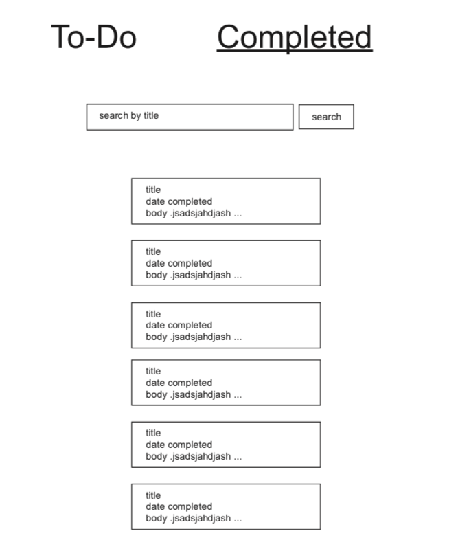
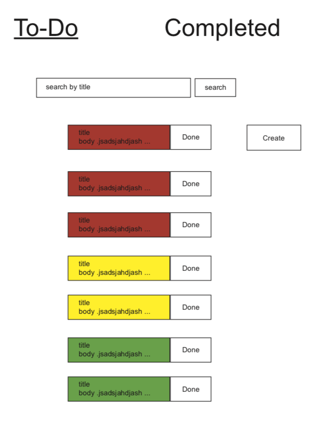
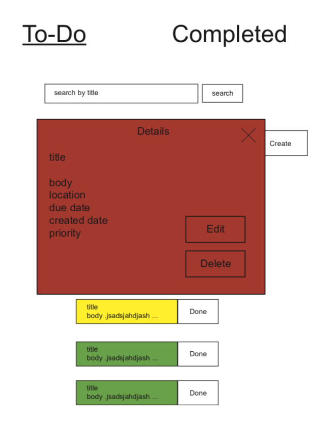
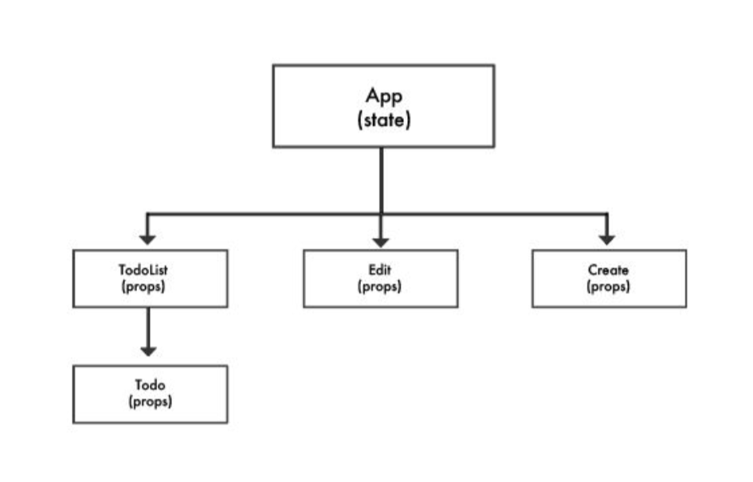
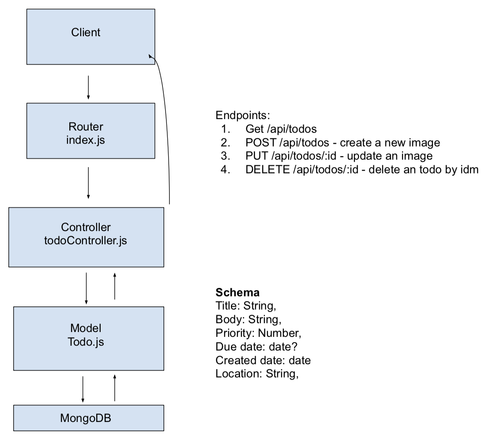

# Tern

### **Project 3 for GA's 622 cohort**

**Team:**

Mahlet Bogale 
Pamela Gilmour 
Xavier Luján 
Tabitha Perry 
_Squad Leader:_ Hou Chia

 

## Project Description

Our team decided to create a to-do app. We wanted to have a place where we could add to-do items and be able to edit them and mark them as complete. We then though about adding a number value so we could prioritize items and give them a visual reference of the priority. Finally, we added a to-do view and a completed view, in order to only see relevant to-do's.

We developed the app using MongoDB, Mongoose, Express, React and Node, and are able to perform full CRUD operations to the database in order to add, edit and delete to-do items.

[This is the Backend repo+planning](https://github.com/tern-app/backend) 
[This is the Frontend repo+planning](https://github.com/tern-app/frontend)

 
 

## User Stories

### MVP User Stories

- As a user, I would like to add an item to my to do list
- As a user, I would like to add a body, priority, location and due date
- As a user, I would like to be able to mark a task as completed
- As a user, I would like to be able to see my completed tasks
- As a user, I would like to delete a task
- As a user, I want to edit my tasks

### Stretch User Stories

- As a user, I would like to be able to sort my to-dos by priority
- As a user, I want to sort by due date, created date, location, etc
- As a user, I want to be able to log in (have authentication)
- As a user I want to be able to search my to-do/completed lists
- As a user, I want to be able to star my to do

 
 

## Wireframes

 
 

## Component Hierarchy

 
 

| **Component** | **Description**                                 | **State/Props** |
| ------------- | ----------------------------------------------- | --------------- |
| App           | This will handle React and call the components  | State           |
| SearchBar     | This will be used for searching through to-do's | Props           |
| TodoList      | This will render the list of to-do's            | Props           |
| Todo          | This will render the individual to-do           | Props           |
| Edit          | This will edit the to-do's properties           | Props           |
| Create        | This will create a new to-do                    | Props           |

 
 

## API

We are building our own API with MongoDB, Mongoose and Express. The backend is deployed using AtlasDB and [Heroku](https://stark-depths-63601.herokuapp.com/tasks/). In order to maintain data consistency we developed a schema. This allows us to always save our data in the same format. Here's an example of how the data is returned:

    {
    	"title": "First to-do",
    	"body": "This is the body of the to do",
    	"createdDate": "2020-08-18",
    	"priority": 1,
    	"completed": false,
    	"completedDate": "2020-08-18",
    	"dueDate": "due date string"
    },
    {
    	"title": "First to-do",
    	"body": "This is the body of the to do",
    	"priority": 1,
    	"createdDate": "2020-08-18",
    	"dueDate": "due date string",
    	"completed": false,
    	"completedDate": "2020-08-18"
    }

 
 

## Request Response Cycle Diagram

